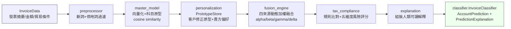

# Taiwan Invoice Account Classifier

台灣電子發票會計科目分類系統 —— 以母版模型＋客戶個人化學習＋稅法合規規則融合，為進項電子發票摘要提供建議會計科目與稅務風險提示的輔助工具。


> ⚠️ 本系統為**稅務輔助與風險提示工具**，非稅務或法律意見。所有分類建議與風險提示僅供內部參考，實際入帳與申報請由企業會計人員或稅務顧問覆核後決定。詳見 [`docs/compliance-disclaimer.md`](docs/compliance-disclaimer.md)。

---

## 目錄

1. [專案背景](#專案背景)
2. [解決的問題](#解決的問題)
3. [系統功能](#系統功能)
4. [系統架構](#系統架構)
5. [技術堆疊](#技術堆疊)
6. [資料流](#資料流)
7. [母版模型與個人化模型的關係](#母版模型與個人化模型的關係)
8. [向量加權方法（alpha / beta / gamma / delta）](#向量加權方法)
9. [稅務合規檢查流程](#稅務合規檢查流程)
10. [安裝方式](#安裝方式)
11. [範例執行方式](#範例執行方式)
12. [測試方式](#測試方式)
13. [測試結果](#測試結果)
14. [效能結果](#效能結果)
15. [專案限制](#專案限制)
16. [資料安全設計](#資料安全設計)
17. [台灣稅法免責聲明](#台灣稅法免責聲明)
18. [未來開發方向](#未來開發方向)
19. [License](#license)

---

## 專案背景

台灣企業每月需處理大量進項電子發票，並將發票摘要對應至正確之會計科目（如進貨、進項稅額、交際費、職工福利等），同時需留意常見稅務風險（如進項稅額重複列報、CIF 運費重複認列、交際費超過列支上限等）。此一分類與覆核工作傳統上高度仰賴人工經驗，容易因人員異動、規則記憶不完整而產生錯誤申報或漏未覆核之風險。

本專案嘗試以「母版模型（歷史案例相似度）＋客戶個人化學習（歷史修正紀錄）＋稅法合規規則庫」三者融合的方式，建立一套可解釋、可增量學習、可由企業自行客製化的分類輔助系統。

## 解決的問題

- 發票摘要文字繁雜、用詞不一致，難以用簡單關鍵字規則涵蓋所有情境。
- 相同賣方、相同摘要模式的發票，理應維持一致的科目分類，但人工作業容易前後不一致。
- 部分稅務風險情境（進項稅額分離、CIF 運費重複認列、交際費上限等）容易被忽略，需要系統性提示。
- 不同企業之會計科目編碼、業務性質不同，需要可客製化而非一體適用的解決方案。

## 系統功能

- 依發票摘要、金額、貿易條件，預測建議會計科目與置信度。
- 提供 Top-K（預設 3）候選科目，供使用者參考次佳選項。
- 依五大風險維度（科目、關鍵字、貿易條件、金額異常、憑證）計算風險等級，高風險案例自動標示建議轉人工覆核。
- 支援客戶歷史修正紀錄之個人化學習（同一公司修正過的案例會影響未來預測）。
- 支援賣方偏好學習（同一賣方過去常被記為某科目時，該資訊納入預測）。
- 內建 6 條台灣稅法合規規則（詳見 [`docs/tax-law-sources.md`](docs/tax-law-sources.md)），提供法規依據說明文字。
- 提供修正紀錄管理（新增／查詢／更新／刪除／匯出／備份）、版本控制與審計紀錄、月報產生等輔助功能。

## 系統架構

系統核心資料流為：

```
InvoiceData → preprocessor → master_model → personalization → fusion_engine → tax_compliance → explanation → classifier(對外介面)
```



完整技術設計說明（各模組職責、設計原則、資料一致性注意事項）請見 [`docs/architecture.md`](docs/architecture.md)。

## 技術堆疊

| 類別 | 使用技術 |
|---|---|
| 語言 | Python 3.10+ |
| 資料驗證 | Pydantic 2.x |
| 中文斷詞 | jieba（含自訂辭典 `assets/custom_dict.txt`） |
| 向量化 | scikit-learn（TF-IDF + TruncatedSVD，離線；保留 Sentence Transformer 後端介面） |
| 數值運算 | NumPy、SciPy |
| 資料處理 | pandas |
| 模型持久化 | joblib |
| 設定檔 | PyYAML（`config/settings.yaml`）、JSON（`config/tax_rules.json`） |
| 測試框架 | pytest、pytest-cov |

## 資料流

1. **輸入**：`InvoiceData`（發票摘要、買方/賣方統編、金額、貿易條件、日期等，經 Pydantic 驗證）。
2. **前處理**：`preprocessor.InvoicePreprocessor` 斷詞＋停用詞過濾（主要供稅法規則關鍵字比對一致性使用）。
3. **母版模型編碼**：`master_model.MasterModel.encode()` 對原始摘要向量化，計算與各科目原型向量的 cosine similarity。
4. **個人化層**：`personalization.PrototypeStore` 提供客戶歷史修正原型與賣方偏好分數。
5. **融合引擎**：`fusion_engine.dynamic_weighted_prediction()` 以 alpha/beta/gamma/delta 加權四來源分數，決定最終預測科目與置信度。
6. **稅法合規**：`tax_compliance` 比對規則庫並計算五維度風險評分，決定最終風險等級。
7. **解釋組裝**：`explanation.build_explanation()` 產生人類可讀說明文字。
8. **輸出**：`classifier.InvoiceClassifier.predict()` 回傳 `ClassificationResult`（`AccountPrediction` + `PredictionExplanation`）。

## 母版模型與個人化模型的關係

- **母版模型（Master Model）**：以「全體／通用訓練資料」建立的科目原型向量庫，代表系統對各科目的**通用**理解，不隨個別客戶而異。所有企業共用同一份母版模型（或依產業別提供不同版本）。
- **個人化模型（Personalization / PrototypeStore）**：以「單一企業」的歷史人工修正紀錄建立的科目原型向量，代表該企業**特有**的記帳慣例與偏好，僅影響該企業自身的預測。
- 兩者在向量空間上**必須維持一致**（相同 embedder、相同維度），融合引擎才能正確計算 cosine similarity 並疊加分數；若個人化原型與母版模型向量空間不一致，該來源分數會退化為 0（不中斷流程，但退化為僅依母版模型＋賣方偏好＋合規規則預測）。
- 個人化學習支援增量更新：新增一筆修正紀錄只需重算受影響科目的原型向量，不需重新訓練母版模型。

## 向量加權方法

融合引擎（`fusion_engine.py`）以下列公式融合四個預測來源：

```
final_score[i] = alpha * master_score[i]
               + beta  * correction_score[i]
               + gamma * seller_score[i]
               + delta * compliance_score[i]

predicted_account = argmax(final_score)
confidence        = final_score[predicted_account]（正規化至 0–1）
```

| 權重 | 對應來源 | 系統預設值 |
|---|---|---|
| `alpha` | 母版模型（歷史案例相似度） | 0.4 |
| `beta` | 客戶修正原型（個人化學習） | 0.3 |
| `gamma` | 賣方偏好（同一賣方歷史科目分佈） | 0.1 |
| `delta` | 稅法合規規則（規則觸發加分/懲罰） | 0.2 |

（預設值定義於 `src/invoice_classifier/classifier.py` 之 `DEFAULT_WEIGHTS`；`config/settings.yaml` 內另提供依企業規模／產業別調整之權重樣板，如新創、中小企業、進出口貿易商、上市櫃公司等情境。）

## 稅務合規檢查流程

1. `TaxRuleEngine` 載入 `config/tax_rules.json`（目前 6 條規則）。
2. 針對每筆發票，依摘要關鍵字與貿易條件等情境條件比對是否觸發規則。
3. 觸發規則將對候選科目分數產生加分或懲罰（如禁止科目直接歸零、或降低置信度）。
4. `assess_invoice_risk()` 另外從科目風險、關鍵字風險、貿易條件風險、金額異常風險、憑證風險五個維度計算風險分數與等級。
5. 系統取「規則觸發風險等級」與「五維度風險評分等級」兩者較高者作為最終風險等級。
6. 風險等級為 high／critical 時，`suggested_action` 一律包含「建議轉人工覆核」之提示。

各規則詳細法規依據見 [`docs/tax-law-sources.md`](docs/tax-law-sources.md)；系統定位與免責聲明見 [`docs/compliance-disclaimer.md`](docs/compliance-disclaimer.md)。

## 安裝方式

```bash
git clone <本專案 repository 網址>
cd taiwan-invoice-account-classifier

python -m venv .venv
source .venv/bin/activate   # Windows: .venv\Scripts\activate

pip install -r requirements.txt
```

`requirements.txt` 內含核心相依套件（pydantic、jieba、scikit-learn、numpy、pandas、scipy、joblib、PyYAML）與開發／測試用套件（pytest、pytest-cov）。

## 範例執行方式

```bash
python examples/run_classification_demo.py
```

此腳本會讀取 `examples/sample_invoices.csv`（35 筆完全虛構之範例發票），使用**確定性假向量編碼器**（`hashlib.md5` 雜湊 n-gram，非正式訓練後模型）建立一個示範用母版模型，逐筆預測並印出人類可讀之預測結果、風險等級與說明摘要。此腳本目的僅在展示完整資料流與輸出格式，**不代表正式訓練後模型的分類品質**。

正式使用前，請參考 `src/invoice_classifier/master_model.py` 之 `train_from_csv()`，以自有訓練資料訓練並產出正式 `master_model.pkl`（本專案不隨附任何已訓練模型檔案）。

## 測試方式

```bash
pip install pytest pytest-cov   # 若尚未安裝
python -m pytest tests/ -v --tb=short
```

## 測試結果

實測於 2026-09-01，Python 3.10.12，pytest 9.1.1：

**136 passed, 4 warnings，耗時 9.50 秒（100% 通過率）。**

6 條稅法規則（`config/tax_rules.json`）皆有對應測試案例觸發覆蓋（覆蓋率 6/6 = 100%）。

詳見 [`reports/test_report.md`](reports/test_report.md)。

## 效能結果

> ⚠️ 以下數字**均為合成評估資料**（`examples/eval_synthetic_invoices.csv`，220 筆程式產生之合成標籤發票），搭配確定性假向量編碼器實測所得，**不代表實際生產環境準確率**，本系統尚未於任何真實發票資料上訓練或驗證。

| 指標 | 數值（實測） |
|---|---|
| Top-1 準確率 | 0.7455（164/220） |
| Macro-F1 | 0.7473 |
| Top-3 準確率 | 0.9364（206/220） |
| 平均預測時間 | 0.166 ms |
| P95 預測時間 | 0.211 ms |

完整數字、各科目混淆情形與方法說明詳見 [`reports/performance_report.md`](reports/performance_report.md)（可用 `python examples/run_evaluation.py` 重新產生）。

## 專案限制

- **本專案不含已訓練模型檔案**，也**未於任何真實發票資料上進行訓練或驗證**；上方效能數字僅為合成資料展示，不可作為生產環境準確率之依據。請執行 `src/invoice_classifier/master_model.py` 內的 `train_from_csv()` 訓練流程，或參考 `docs/` 說明，以自有真實或更貼近真實分佈的資料自行建立正式模型。
- 系統輸出之會計科目代碼為預設值，**非唯一標準答案**，實際科目編碼應依企業自身會計制度調整（支援自訂科目對照表）。
- 任何高風險（high／critical）案例，**務必**轉交企業會計人員或稅務顧問人工覆核，系統輸出不構成稅務或法律意見。
- 目前向量化預設為 TF-IDF + SVD 離線方案；Sentence Transformer 後端介面雖已保留，但需額外網路環境下載模型權重，尚未實際整合測試其效能與準確率表現。

## 資料安全設計

- `examples/` 目錄下之 `sample_invoices.csv`、`eval_synthetic_invoices.csv` **皆為程式產生或人工編造之合成資料**，不含任何真實企業統一編號、真實交易紀錄或真實金額，可安全地公開於版本控管系統中。
- `.gitignore` 已明確排除：
  - 機密與憑證檔案（`.env`、`*.key`、`*.pem`、`credentials.json`、`secrets.json`）。
  - 已訓練模型二進位檔（`*.pkl`、`*.pt`、`*.onnx`），避免內含訓練資料痕跡之模型檔被意外提交。
  - 執行期產生之客戶資料、修正紀錄、審計紀錄、備份（`data/corrections/`、`data/audit/`、`backups/`）。
  - 任何近似真實客戶資料檔名（如含「真實發票」「歷史發票」等字樣之檔案），即使檔名不同也不得提交近似檔案。
  - `reports/*.md`、`reports/*.json`（測試與效能報告本身可能因重新產生而含執行環境資訊，預設不提交，僅保留 `.gitkeep`）。

## 台灣稅法免責聲明

本系統為**稅務輔助與風險提示工具**，非稅務或法律意見；AI 不自行判定使用者有無逃漏稅意圖；高風險結果一律建議轉人工覆核；系統不以單一關鍵字直接宣稱違法；科目代碼可能因公司會計制度不同而調整，非唯一標準答案。

完整聲明內容請見 [`docs/compliance-disclaimer.md`](docs/compliance-disclaimer.md)。

## 未來開發方向

- 以真實（去識別化）發票資料進行母版模型訓練與正式準確率驗證，取代目前合成資料展示。
- 整合 Sentence Transformer 後端並實測其準確率與效能表現，評估是否作為預設向量化方案。
- 擴充稅法規則庫，涵蓋更多常見稅務風險情境（如零稅率、免稅項目、跨境電商代收代付等）。
- 提供 Web UI 或 API 服務介面，取代目前純命令列示範腳本。
- 建立更嚴謹之離線評估流程（交叉驗證、時間切分驗證），並建立持續監控機制偵測模型飄移。

## License

本專案採用 [MIT License](LICENSE) 授權。
