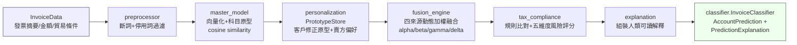

# 系統架構設計文件（Architecture）

## 一、系統定位

台灣電子發票會計科目分類系統（Taiwan Invoice Account Classifier）為一套**稅務輔助與風險提示工具**，協助使用者將進項電子發票摘要對應到建議的會計科目，並提示可能的稅務風險與合規注意事項。

系統設計上明確遵守以下原則：

- 所有輸出（建議科目、置信度、風險等級）僅供內部記帳與風險自我檢核參考，**不構成正式稅務或法律意見**。
- 系統不會、也不應被用於協助規避稅捐、隱匿所得或偽造憑證；系統設計目的是降低錯誤申報、重複列報、不得扣抵及憑證不完整等風險，而非判定任何使用者的主觀意圖。
- 任何高風險（`high` / `critical`）或系統無法確定之判斷，均標示「建議轉人工覆核」。
- 科目代碼為系統預設值，非唯一標準答案；企業可透過自訂科目對照表覆寫。

本文件內容不涉及任何特定企業或真實歷史交易資料，僅描述系統本身之技術設計。

## 二、五大核心模組與職責

系統由 `src/invoice_classifier/` 下的模組組成，核心資料流涉及以下五大模組（另有 `explanation.py` 負責整合輸出、`classifier.py` 作為對外主要 API）：

### 1. `preprocessor.py` —— 前處理與向量化

- 使用 jieba 斷詞，並載入 `assets/custom_dict.txt`（會計科目／稅務／貿易專有名詞自訂辭典），避免關鍵詞（如「進項稅額」「報關費」）被拆散為不具語意的單字。
- 停用詞過濾採「精簡白名單式排除」，僅移除虛詞（的、了、在等），保留數字、金額、百分比，因其可能是稅法規則觸發的依據。
- 向量化預設使用 TF-IDF + SVD（離線、不依賴網路），並保留 Sentence Transformer 後端介面供未來切換。

### 2. `master_model.py` —— 母版模型（科目原型向量庫）

- 非傳統「分類器權重」，而是「科目原型向量庫」：對訓練集內每筆發票摘要向量化後，依歷史正確科目分組，計算各科目平均向量（原型向量）。
- 推論時，新摘要向量化後與各科目原型向量計算 cosine similarity，最相似者作為母版模型分數來源。
- 此設計具備可解釋性（可說明「與哪個科目的歷史案例最相似」）與增量友善性（新增訓練資料只需重算受影響科目原型，不需整體重新訓練）。
- 本 repo 不包含已訓練完成的模型檔（`.pkl`），須由使用者以自有訓練資料執行 `train_from_csv()` 重建。

### 3. `personalization.py` —— 客戶個人化學習層

- 將同一家公司的人工修正紀錄（`CorrectionRecord`），依修正後科目分組，計算「加權平均原型向量」，建立客戶專屬科目偏好原型字典。
- 權重由三項相乘組成：可信度權重（人工設定 0–1）、時間衰減權重（半衰期預設 90 天）、修正次數加成權重（最多以 5 次歸一化）。
- 支援增量更新：`PrototypeStore` 同時保存「加權向量總和」與「權重總和」，新增修正紀錄時僅需針對受影響科目重新累加。

### 4. `fusion_engine.py` —— 動態加權融合引擎

融合四個預測來源，輸出最終科目預測：

```
final_score[i] = alpha * master_score[i]
               + beta  * correction_score[i]
               + gamma * seller_score[i]
               + delta * compliance_score[i]

predicted_account = argmax(final_score)
confidence        = final_score[predicted_account]（正規化至 0–1）
```

四來源分別為：母版模型（摘要向量 vs 科目原型向量）、客戶修正原型（摘要向量 vs 該公司歷史修正學到的原型向量）、賣方偏好（該賣方統編過去被記過的科目分佈）、稅法合規規則（規則觸發後對科目分數的加分／懲罰）。系統預設權重組合（`alpha=0.4, beta=0.3, gamma=0.1, delta=0.2`）依企業規模／產業別可調整（見 `config/settings.yaml` 之權重樣板）。

### 5. `tax_compliance.py` —— 稅法合規檢查

- `TaxRuleEngine`：載入 `config/tax_rules.json` 規則庫（目前 6 條規則），依發票摘要／貿易條件比對觸發規則（進項稅額分離、CIF 運費不得重複列報、報關費併入進貨成本、交際費列支上限、員工福利 vs 交際費、自用乘人小汽車進項稅額不得扣抵）。
- `assess_invoice_risk()`：五大風險維度評分（科目風險、關鍵字風險、貿易條件風險、金額異常風險、憑證風險），輸出風險分數（0–1）、風險等級（low/medium/high/critical）、風險旗標與合規提醒文字。
- 規則觸發僅代表「存在需要留意的稅務風險情境」，不逕自宣稱使用者違法。

### 6. `explanation.py` —— 解釋整合層

- 讀取 `fusion_engine.dynamic_weighted_prediction()` 輸出的分數拆解與規則觸發資訊，組裝成人類可讀（繁體中文）的預測解釋，說明系統為何做出此預測、觸發了哪些稅法規則、是否建議轉人工覆核及理由。

### 對外主要介面：`classifier.py`

`InvoiceClassifier.predict()` 是串接以上模組的對外主要 API，回傳 `ClassificationResult`（含 `prediction`、`explanation`、`fusion_raw`）。

## 三、資料流圖



補充說明：

- `preprocessor` 的斷詞結果主要用於稅法規則之關鍵字比對一致性；母版模型的向量化直接對「原始摘要」進行，與訓練時保持一致（見 `MasterModel.encode()`）。
- `personalization` 與 `fusion_engine` 之間的資料傳遞為「客戶修正原型字典」與「賣方偏好字典」，這兩者須與母版模型使用相同的向量化器（embedder）與維度，否則 cosine similarity 會因維度不一致而回傳 0（該來源分數視同無證據，不中斷流程但不提供個人化資訊）。
- `tax_compliance` 除了在 `fusion_engine` 內部作為分數來源之一（`compliance_score`），另外在 `classifier.predict()` 中會再次呼叫 `assess_invoice_risk()` 做補充風險評分，兩者取風險等級較高者作為最終風險等級，避免僅靠規則觸發而遺漏金額或憑證類風險。

## 四、輔助模組

除上述資料流核心模組外，系統另包含：

- `data_models.py`：Pydantic 資料模型（`InvoiceData`、`AccountPrediction`、`CompanyProfile`、`RiskLevel` 等），提供輸入驗證。
- `storage.py`：`CorrectionManager`（人工修正紀錄的新增／查詢／更新／刪除／匯出／備份／併發控制）。
- `report.py`：月報產生器，彙整一段期間內的分類結果、風險分佈與資料品質統計。

## 五、設計原則總結

1. **可解釋優先**：母版模型與融合引擎皆以「與哪些歷史案例／規則相似」為核心邏輯，而非黑箱分類器輸出，便於使用者理解與覆核。
2. **離線優先**：預設向量化與規則比對皆不依賴外部網路服務，僅在未來啟用 Sentence Transformer 後端時才需要連網下載模型權重。
3. **保守輸出**：任何不確定或高風險情境，一律傾向標示「建議轉人工覆核」，而非自動給出確定性結論。
4. **企業客製化**：科目代碼、對照表、權重組合皆可由企業依自身會計制度調整，系統預設值僅為起始基準。
